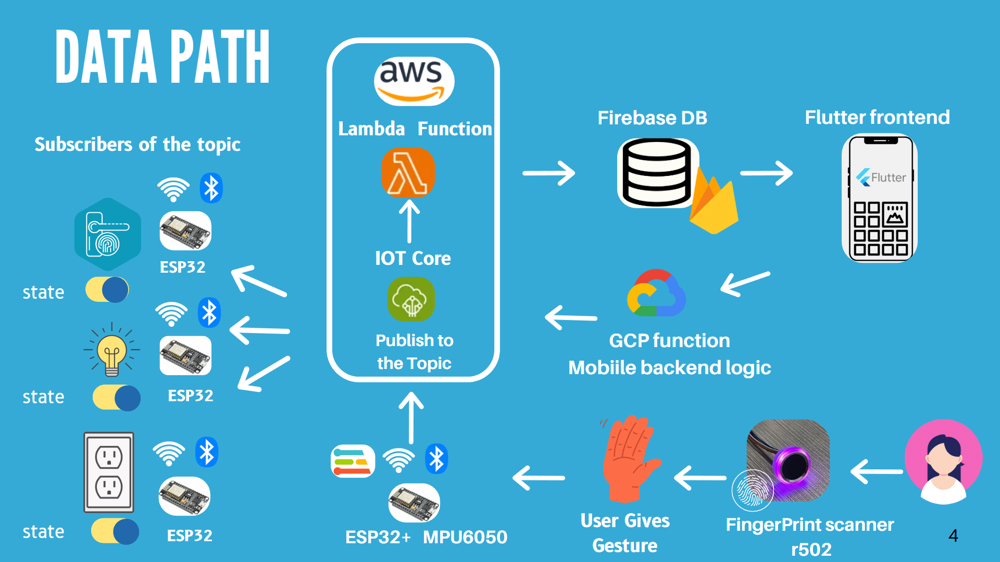

___
# FlickNest: Gesture-Controlled Smart Home Automation
___

  

## Team
-  E/20/069, Dilshan D.M.T. , [e20069@eng.pdn.ac.lk](mailto:e20069@eng.pdn.ac.lk)
-  E/20/189, Karunarathne K.N.P., [e20189@eng.pdn.ac.lk](mailto:e20189@eng.pdn.ac.lk)
-  E/20/328, Rathnaweera R.V.C, [e20328@eng.pdn.ac.lk](mailto:e20328@eng.pdn.ac.lk)
-  E/20/455, Dilshan W.M.N, [e20455@eng.pdn.ac.lk](mailto:e20455@eng.pdn.ac.lk)

---

## Supervisor
-  Dr. Isuru Nawinne , [isurunawinne@eng.pdn.ac.lk](mailto:isurunawinne@eng.pdn.ac.lk)

---

#### Table of Contents
1. [Introduction](#introduction)
2. [Solution Architecture](#solution-architecture)
3. [Hardware & Software Designs](#hardware-and-software-designs)
4. [Testing](#testing)
5. [Detailed budget](#detailed-budget)
6. [Links](#links)

---

## Introduction

**FlickNest** is a smart home automation system that introduces gesture-based device control using a wearable device. A user wearing the gesture-detecting band can perform hand gestures to turn on lights, unlock doors, or control sockets. It uses an ESP32 microcontroller with an MPU6050 sensor and a TinyML model trained to classify gestures. The system supports both cloud-based communication via **AWS IoT Core** and **offline/local control via Mosquitto MQTT**, ensuring continuous operation even during internet outages.

This solution enhances accessibility, security, and ease of interaction with home appliances, making it highly suitable for both modern smart homes and accessibility-focused environments.

---

## Solution Architecture

The system is divided into the following components:

- **Gesture Band**: Worn by the user, containing the ESP32 + MPU6050 sensor to capture hand movements.
- **TinyML Model**: Classifies gestures on-device using Edge Impulse.
- **MQTT Brokers**: Dual communication model using AWS IoT Core and local Mosquitto.
- **Firebase Realtime Database**: Stores device list, user roles, environments, and real-time device states.
- **Flutter App**: Used to add devices, manage users, assign gestures, and monitor usage.

---

## Hardware and Software Designs

### Hardware
- ESP32 Dev Module
- MPU6050 Accelerometer + Gyroscope Sensor
- Relay Module for appliances
- Fingerprint sensor module for door access
- Power Supply & Battery

### Software
- Arduino C++ code for ESP32
- TinyML model via Edge Impulse
- Flutter mobile application
- Firebase Realtime Database integration
- AWS IoT Core configuration
- Mosquitto broker setup for offline usage

### Roles and Access
- **Admin**: Full access to add/remove users/devices, manage environments.
- **Co-admin**: Can manage users and devices (no role changes).
- **User**: Only allowed to automate assigned devices.

### Environment Structure
- Each *environment* contains multiple *rooms* (e.g., Living Room, Kitchen).
- Devices are assigned to rooms and mapped with a **unique gesture symbol**.
- Only assigned devices can be controlled via matched gestures.

---

## Testing

Testing was conducted under various scenarios:

| Test Case                              | Result       |
|----------------------------------------|--------------|
| Gesture recognition accuracy           | ~94%         |
| Device switching latency (WiFi)        | <300ms       |
| Offline MQTT failover                  | Successful   |
| Firebase sync after offline recovery   | Working well |
| Role-based restrictions in mobile app  | Verified     |
| Obstacle handling (door lock testing)  | Accurate     |

Edge cases such as unstable WiFi and unrecognized gestures were also considered, with fallbacks and logs added to the ESP32 firmware.

---

## Detailed budget

| Item                                           | Quantity | Unit Cost (LKR) | Total (LKR) |
|----------------------------------------------  |:--------:|:---------------:|------------:|
| Speed Xiao ESP32 Board                         | 1        | 3,200           | 3,200       |
| ESP32 Dev Module Board                         | 4        | 2,400           | 9,600       |
| IMU Sensor                                     | 1        | 1,000           | 1,000       |
| R502 Fingerprint Sensor                        | 1        | 6,300           | 6,300       |
| Battery Pack                                   | 1        | 200             | 200         |
| Plug Socket                                    | 1        | 1,000           | 1,000       |
| Electronic Door Lock                           | 1        | 2,500           | 2,500       |
| 230V to 5V Converters                          | 4        | 300             | 1,200       |
| Relays, Triacs, Resistors, etc.                | 4        | 300             | 1,200       |
| Wires, Soldering Components                    | 1        | 3,000           | 3,000       |
| Other Expenses                                 | 1        | 2,000           | 2,000       |
| Flexible 3D Printed Wearable Band              | 1        | 1,800           | 1,800       |
| **Total**                                      |          |                 | **33,000**  |

---

## Links

- [Project Repository](https://github.com/cepdnaclk/e20-3yp-FlickNest.git)
- [Project Page](https://cepdnaclk.github.io/e20-3yp-FlickNest/)
- [Department of Computer Engineering](http://www.ce.pdn.ac.lk/)
- [University of Peradeniya](https://eng.pdn.ac.lk/)

[//]: # (Markdown Guide: https://github.com/adam-p/markdown-here/wiki/Markdown-Cheatsheet)
